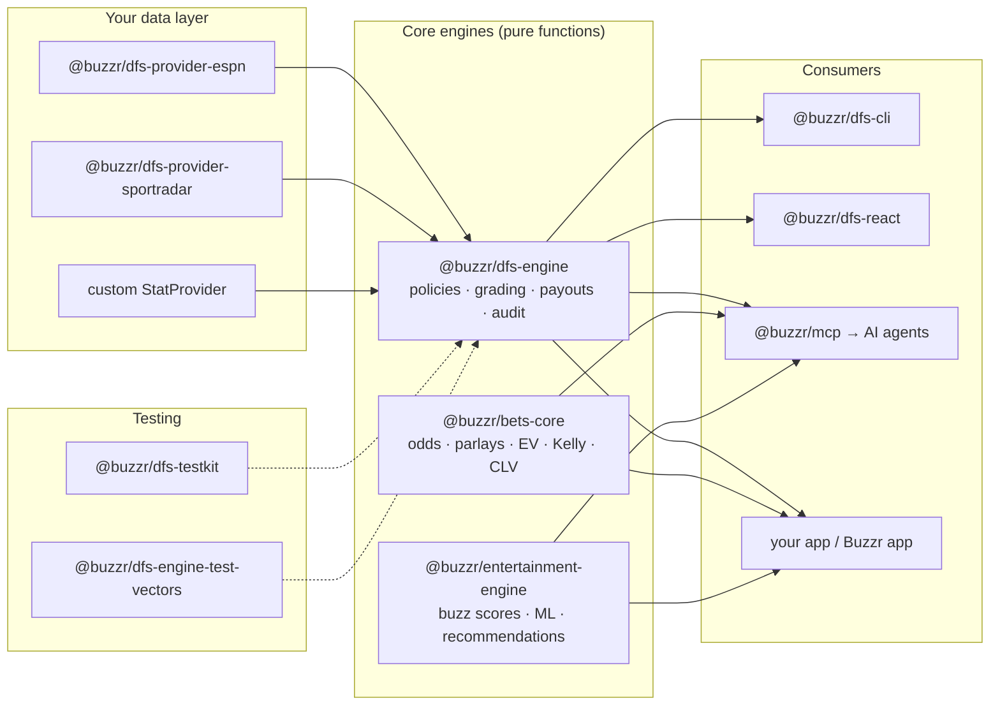

# Buzzr Sports Engines

[](https://github.com/Buzzr-app/dfs-engine/actions/workflows/ci.yml)
[](LICENSE)
[](https://github.com/Buzzr-app/dfs-engine)
[](https://buzzr-app.github.io/dfs-engine/)

**Pure-TypeScript, zero-dependency engines for sports betting and DFS apps** — auditable pick'em settlement, sportsbook odds math, and transparent game-entertainment scoring. Every package is a set of pure functions: no I/O, no framework lock-in, no native deps. Feed data in, get deterministic, explainable decisions out — with validation reports and audit trails, because settling money on `if (points > line)` is how disputes happen. Built and used in production by Buzzr, a sports social app.

## The packages

| Package                                                                                          | What it does                                                                       | Install                                   |
| ------------------------------------------------------------------------------------------------ | ----------------------------------------------------------------------------------- | ------------------------------------------ |
| [`@buzzr/dfs-engine`](https://www.npmjs.com/package/@buzzr/dfs-engine)                            | DFS settlement OS: book policies, grading, payouts, audit trails, batch settlement   | `npm i @buzzr/dfs-engine`                  |
| [`@buzzr/bets-core`](https://www.npmjs.com/package/@buzzr/bets-core)                              | Odds math: no-vig fair lines, parlays, EV, Kelly staking, CLV, period analytics      | `npm i @buzzr/bets-core`                   |
| [`@buzzr/entertainment-engine`](https://www.npmjs.com/package/@buzzr/entertainment-engine)        | Transparent buzz scoring, hybrid ML predictions, personalized game recommendations   | `npm i @buzzr/entertainment-engine`        |
| [`@buzzr/mcp`](https://www.npmjs.com/package/@buzzr/mcp)                                          | MCP server exposing the engines to AI agents (8 tools)                               | `npx -y @buzzr/mcp`                        |
| [`@buzzr/dfs-cli`](https://www.npmjs.com/package/@buzzr/dfs-cli)                                  | Grade a DFS entry from JSON on the command line                                      | `npm i -g @buzzr/dfs-cli`                  |
| [`@buzzr/dfs-react`](https://www.npmjs.com/package/@buzzr/dfs-react)                              | Settlement → UI view-models (React/Vue/Svelte/vanilla; no React dep)                 | `npm i @buzzr/dfs-react`                   |
| [`@buzzr/dfs-testkit`](https://www.npmjs.com/package/@buzzr/dfs-testkit)                          | Fixture builders + mock stat providers for tests                                     | `npm i -D @buzzr/dfs-testkit`              |
| [`@buzzr/dfs-provider-espn`](https://www.npmjs.com/package/@buzzr/dfs-provider-espn)              | ESPN-shaped stat provider contract                                                   | `npm i @buzzr/dfs-provider-espn`           |
| [`@buzzr/dfs-provider-sportradar`](https://www.npmjs.com/package/@buzzr/dfs-provider-sportradar)  | Sportradar-shaped stat provider contract                                             | `npm i @buzzr/dfs-provider-sportradar`     |
| [`@buzzr/dfs-engine-test-vectors`](https://www.npmjs.com/package/@buzzr/dfs-engine-test-vectors)  | Golden fixtures proving your integration grades identically to Buzzr's               | `npm i -D @buzzr/dfs-engine-test-vectors`  |

All packages: TypeScript-first with full `.d.ts`, ESM + CJS builds (the CLI is ESM-only), Node >= 22, MIT, zero runtime dependencies outside the family.

## Architecture



## Quick starts

### Settle a DFS entry — `@buzzr/dfs-engine`

```ts
import { createDfsEngine, defineStatProvider } from '@buzzr/dfs-engine';

const provider = defineStatProvider({
  id: 'my-stats',
  getGameLog: ({ leg }) => fetchGameLogRows(leg.playerId, leg.gameDate),
});

const engine = createDfsEngine({ statProviders: [provider] });

const result = await engine.settleEntry(entry, { statProviderId: 'my-stats' });
// result.status, result.payout, result.legs[].actual, result.auditTrail, ...

// v5: settle a whole slate in one call with a shared, memoized stat cache
const batch = await engine.settleEntries(entries, { statProviderId: 'my-stats' });
```

Book policies for PrizePicks- and Underdog-style play types are built in and versioned; custom books plug in via `defineBookPolicy`, and v5 adds policy validation plus a draft prediction-market (Kalshi-style) policy.

### Price a bet — `@buzzr/bets-core`

```ts
import {
  americanOddsToImpliedProbability,
  calculateNoVigFairLine,
  calculateExpectedValue,
  calculateKellyStake,
} from '@buzzr/bets-core';

americanOddsToImpliedProbability(-120); // 0.545455

const fair = calculateNoVigFairLine({
  selected: { side: 'home', americanOdds: -120 },
  opposite: { side: 'away', americanOdds: 100 },
}); // vig removed → fair probability for the selected side

const ev = calculateExpectedValue({ stake: 100, americanOdds: 120, winProbability: 0.5 });

const kelly = calculateKellyStake({ bankroll: 1000, americanOdds: 120, winProbability: 0.5 });
// kelly.recommendedStake — quarter-Kelly by default
```

v5 also ships parlay math (`combineAmericanOdds`, `calculateParlayFairValue`), closing-line value, and period analytics (`calculateRollupByPeriod`, `calculateDrawdown`, `calculateStreaks`).

### Score a game — `@buzzr/entertainment-engine`

```ts
import { resolveBuzzScores, isMustWatch } from '@buzzr/entertainment-engine';

const scores = resolveBuzzScores(
  {
    league: 'NBA',
    status: 'final',
    entertainmentScore: 87,
    predictedEntertainmentScore: 74,
  },
  { upcomingLike: false },
);
// scores.entertainmentScore, scores.predictedEntertainmentScore,
// scores.source (which model won), scores.diagnostics (why)

isMustWatch(scores.entertainmentScore); // boolean against the must-watch threshold
```

v5 adds calibrated ML confidence, DST-safe primetime detection, search-heat and star-power features, and `rankGamesForUser` personalized recommendations.

### Give it to your AI agent — `@buzzr/mcp`

Add to your MCP client config (Claude Desktop, Claude Code, Cursor, …):

```json
{
  "mcpServers": {
    "buzzr": {
      "command": "npx",
      "args": ["-y", "@buzzr/mcp"]
    }
  }
}
```

The server exposes the engines as 8 tools — settle entries, price parlays, compute EV/Kelly, score games — so agents get book-accurate math instead of hallucinated numbers.

## Used in production by Buzzr

These packages are extracted from — and power — the Buzzr sports app: DFS slip grading, sportsbook bet tracking, and the buzz scores on every game card run through exactly this code. The app is the first consumer of every release, so the published API is the one we live with ourselves.

## Development

```bash
npm ci
npm run typecheck
npm test
npm run build
```

## Release hardening

Before publishing or cutting a release, run:

```bash
npm run verify
npm run audit:high
```

`verify` runs typecheck, lint, format check, tests, coverage, build, docs, export smoke tests, package size checks, and a dry-run pack across all packages.

## Reporting bugs

Use the GitHub bug report template for package defects. Include the package version, Node version, book policy/play type, provider data shape, and a minimal reproduction.

For settlement correctness or security-sensitive issues, follow [SECURITY.md](SECURITY.md) so reports can be triaged before public disclosure.

## Links

- [API docs (typedoc)](https://buzzr-app.github.io/dfs-engine/)
- [Issues](https://github.com/Buzzr-app/dfs-engine/issues)
- [AGENTS.md](AGENTS.md) — how AI coding agents should use this repo
- [llms.txt](llms.txt) — machine-readable package index

## License

MIT
