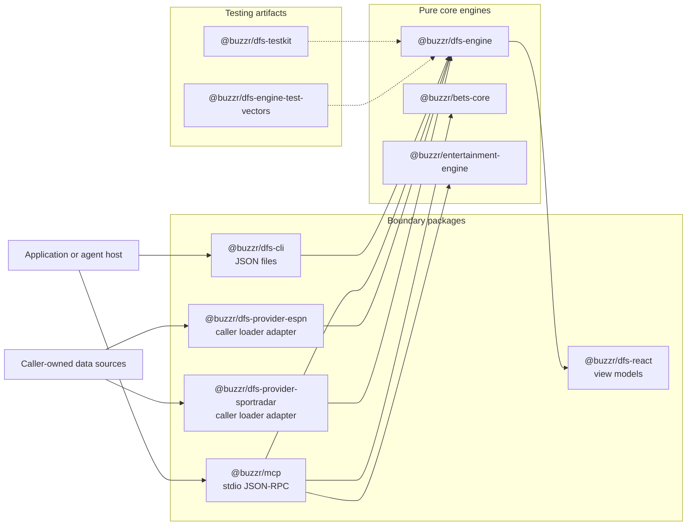

# Architecture and data flow

Buzzr Sports Engines separates deterministic domain code from process and data-source boundaries. The repository contains ten packages, but only three are core engines.

## Layers



### Core engines

- `@buzzr/dfs-engine` owns canonical DFS inputs, policy and payout definitions, stat extraction, validation, settlement, explanations, provenance, and audit records.
- `@buzzr/bets-core` owns sportsbook odds conversion, no-vig pricing, parlays, expected value, Kelly sizing, closing-line value, and history analytics.
- `@buzzr/entertainment-engine` owns transparent game-entertainment scoring, model diagnostics, training/reporting helpers, and personalized ranking.

The core engines have zero external runtime dependencies and perform no network or filesystem I/O. New domain behavior belongs here when it can remain deterministic from supplied inputs.

### Boundary packages

- `@buzzr/mcp` is a local stdio process. The official MCP SDK handles JSON-RPC, Zod validates bounded tool inputs, and handlers call the core engines. Protocol messages use stdout; diagnostics use stderr.
- `@buzzr/dfs-cli` reads two JSON files and delegates settlement to `@buzzr/dfs-engine`.
- `@buzzr/dfs-provider-espn` and `@buzzr/dfs-provider-sportradar` adapt consumer-supplied loaders. They do not contain vendor API clients or credentials.
- `@buzzr/dfs-react` converts settlement results into framework-neutral display models. It does not depend on a React runtime.
- `@buzzr/dfs-testkit` builds fixtures and injected mock providers.
- `@buzzr/dfs-engine-test-vectors` publishes versioned engine regression fixtures. It is not an operator certification suite.

## DFS settlement flow

1. A caller builds a `DfsEntryInput` and supplies observed values directly or registers a `StatProvider`.
2. The engine validates the entry, selects a policy and effective-dated payout table from the entry's `placedAt` or deterministic settlement clock, and resolves each leg.
3. A provider path validates rows and matches the requested game date. Missing, ambiguous, invalid, and unsupported data remain explicit rather than silently selecting a value.
4. The selected policy handles caller-supplied statuses such as DNP, push, void, rescue, or cancellation.
5. The result includes payout, per-leg decisions, validation, policy/table metadata, verification, confidence, source references, provider provenance, explanation codes, pending reasons, and an ordered audit trail.

Built-in operator-named policies are compatibility profiles. PrizePicks is experimental/partial and Underdog is experimental/unverified. Displayed entry terms and explicit operator rulings remain authoritative.

## MCP flow

```text
MCP client
  -> newline-delimited JSON-RPC over stdin
  -> 2 MiB frame guard
  -> MCP SDK request-envelope handling
  -> process-wide 32-call guard
  -> bounded handler-owned Zod validation
  -> one of 11 bounded tool handlers
  -> core engine
  -> at most 1 MiB serialized JSON text result
  -> JSON-RPC over stdout
```

Invalid tool arguments use the same bounded `invalid_input` result over a real MCP transport and through direct exported handlers. Handler-owned validation prevents raw SDK/Zod issue lists from bypassing the result-size cap. Malformed JSON-RPC envelopes remain MCP SDK protocol errors. Tool runtime errors are generic and do not expose internal error messages.

The MCP process computes only from supplied data. It does not fetch live odds, box scores, operator accounts, or private user data.

## State and immutability

Engine instances own policy, payout-table, provider, adapter, clock, and audit configuration. Public policy listings are immutable snapshots. Batch settlement owns a per-call cache and returns new result objects when adding cache-hit metadata; it does not mutate prior single-entry results.

## Repository and app boundary

This monorepo is the public package source of record. The Buzzr mobile app's `release/ios-2.0.0` branch is a separate consumer that currently vendors local 5.0.0 tarballs for `@buzzr/bets-core`, `@buzzr/dfs-engine`, and `@buzzr/entertainment-engine`. Public vNext work does not update that app until a separate reviewed app release deliberately changes its vendored artifacts.

## Related references

- [All-package API index](api-reference.md)
- [Security, privacy, and threat model](security-and-privacy.md)
- [Versioning, compatibility, and support](versioning-and-support.md)
- [MCP install and contracts](../packages/mcp/README.md)
